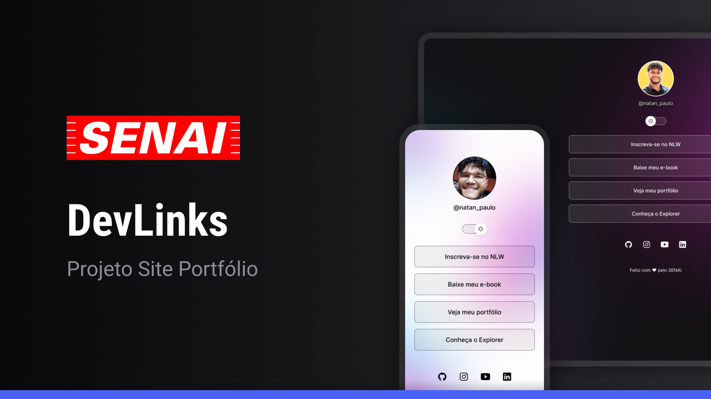

<h1 align="center"> Portfólio </h1>

Programa exclusivo e gratuito, promovido pelo SENAI para ensino de tecnologias WEB.  
<a href="https://sp.senai.br">Estude esse projeto conosco.</a>

  <a href="#-tecnologias">Tecnologias</a>&nbsp;&nbsp;&nbsp;|&nbsp;&nbsp;&nbsp;
  <a href="#-projeto">Projeto</a>&nbsp;&nbsp;&nbsp;|&nbsp;&nbsp;&nbsp;
  <a href="#-layout">Layout</a>&nbsp;&nbsp;&nbsp;|&nbsp;&nbsp;&nbsp;
  <a href="#memo-licença">Licença</a>

  

 

  

## 🚀 Tecnologias

Esse projeto foi desenvolvido com as seguintes tecnologias:

- HTML e CSS
- JavaScript
- Git e Github
- Figma

## 💻 Projeto

O DevLinks é um agregador de links para usar como cartão de visitas online.

- [Acesse o projeto finalizado, online](https://github.com/NatanPaulo/portfoliosenai.git)

- [Acesse o site](https://sp.senai.br)

## 🔖 Layout

Você pode visualizar o layout do projeto através [DESSE LINK](https://www.figma.com/design/GfH4Dst2HFybWPkTARSA6w/Projeto-Portf%C3%B3lio?node-id=10-620&t=F1I9igEJ0bGghdt3-1). É necessário ter conta no [Figma](https://figma.com) para acessá-lo.

## :memo: Licença

Esse projeto está sob a licença MIT.

---

Feito com ♥ by SENAI :wave: [Venha nos conhecer!](https://sp.senai.br)
# portfolio
# portfolio
